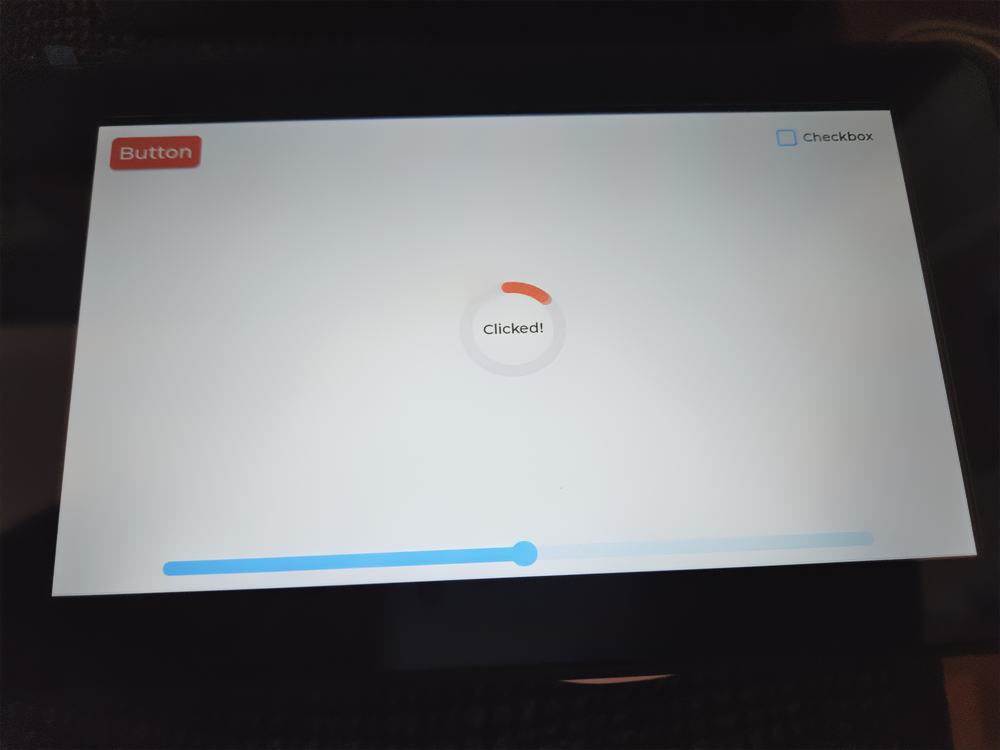

# WS7_ESPHOME

En este repositorio se pretende usar esphome y lvgl en una placa de desarrollo waveshare ESP32-S3-Touch-LCD-7



Para poder usarlo, crea tu propio archivo secrets.yaml en el directorio ws7_esphome con los siguientes datos:

````
# Your Wi-Fi SSID and password
wifi_ssid: "your_ssid"
wifi_password: "your_password"
````  

Y ejecutar en el terminal el siguiente comando:
````
esphome run ws7_esphome.yaml
````


